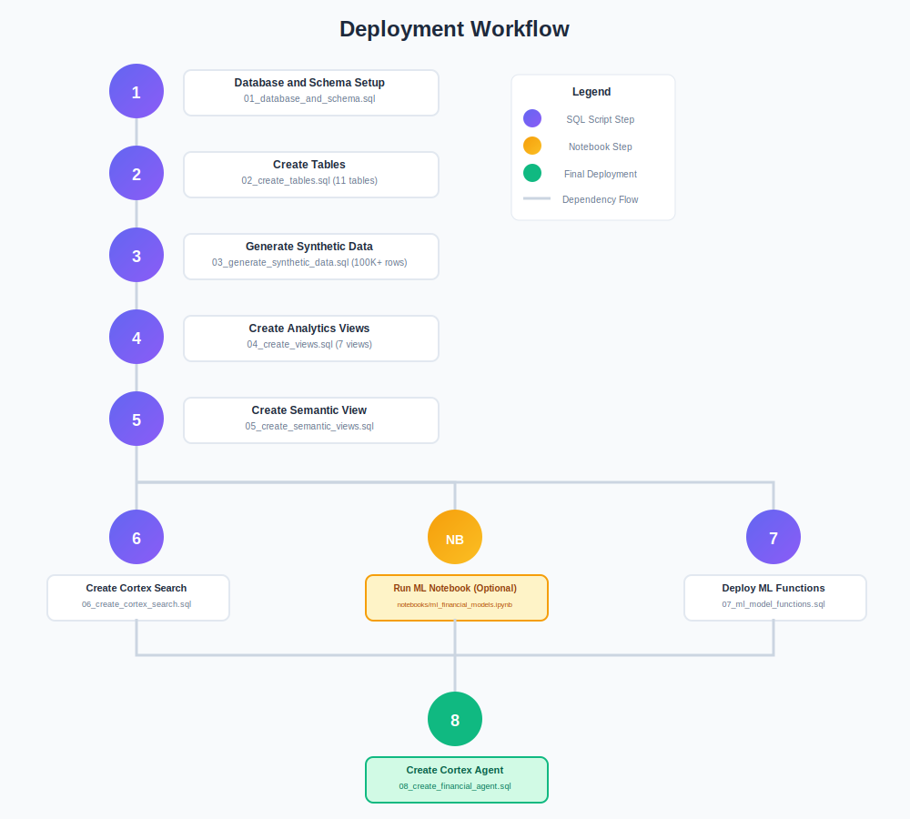
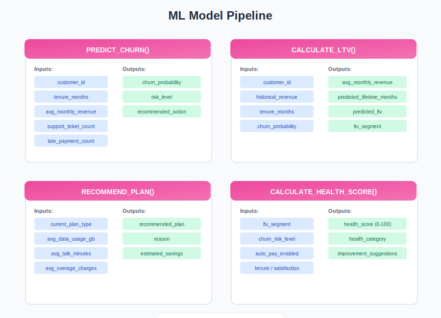

# Consumer Cellular Intelligence Agent

A Snowflake Cortex Agent solution for customer analytics, financial insights, and support operations for Consumer Cellular.

## Architecture


## Features

- **Natural Language Queries** - Ask questions in plain English about customers, revenue, and support
- **Customer Analytics** - Segmentation, lifetime value, and churn risk analysis
- **Financial Insights** - Revenue trends, billing metrics, and plan performance
- **Support Intelligence** - Ticket analysis, resolution times, and satisfaction scores
- **Knowledge Base Search** - Semantic search over help articles and documentation
- **ML Predictions** - Churn probability, LTV scoring, and plan recommendations

## Project Structure

```
.
├── sql/
│   ├── setup/
│   │   ├── 01_database_and_schema.sql
│   │   └── 02_create_tables.sql
│   ├── data/
│   │   └── 03_generate_synthetic_data.sql
│   ├── views/
│   │   ├── 04_create_views.sql
│   │   └── 05_create_semantic_views.sql
│   ├── search/
│   │   └── 06_create_cortex_search.sql
│   ├── models/
│   │   └── 07_ml_model_functions.sql
│   └── agent/
│       └── 08_create_financial_agent.sql
├── notebooks/
│   └── ml_financial_models.ipynb
└── docs/
    ├── AGENT_SETUP.md
    ├── DEPLOYMENT_SUMMARY.md
    ├── questions.md
    └── images/
```

## Deployment



### Quick Start

Execute the SQL scripts in order:

```bash
snowsql -f sql/setup/01_database_and_schema.sql
snowsql -f sql/setup/02_create_tables.sql
snowsql -f sql/data/03_generate_synthetic_data.sql
snowsql -f sql/views/04_create_views.sql
snowsql -f sql/views/05_create_semantic_views.sql
snowsql -f sql/search/06_create_cortex_search.sql
snowsql -f sql/models/07_ml_model_functions.sql
snowsql -f sql/agent/08_create_financial_agent.sql
```

### Prerequisites

- Snowflake account with ACCOUNTADMIN privileges
- Access to Cortex AI features
- Warehouse (X-Small minimum)

## ML Model Functions



| Function | Purpose |
|----------|---------|
| `PREDICT_CHURN()` | Calculate churn probability and risk level |
| `CALCULATE_LTV()` | Predict customer lifetime value |
| `RECOMMEND_PLAN()` | Suggest optimal plan based on usage |
| `CALCULATE_HEALTH_SCORE()` | Compute composite customer health score |

## Data Model

| Table | Description |
|-------|-------------|
| CUSTOMERS | 5,000 customer profiles |
| PLANS | 10 service plans |
| SUBSCRIPTIONS | Customer-plan mappings |
| BILLING | Invoice and payment records |
| USAGE_DATA | Monthly usage metrics |
| SUPPORT_TICKETS | Support cases |
| KNOWLEDGE_BASE | Help articles |
| CHURN_PREDICTIONS | ML churn predictions |
| CUSTOMER_LTV | Lifetime value scores |

## Usage Examples

```sql
-- Query the agent
SELECT CCI_INTELLIGENCE.ANALYTICS.CCI_FINANCIAL_AGENT(
  'How many customers are at high churn risk?'
);

-- Ask about revenue
SELECT CCI_INTELLIGENCE.ANALYTICS.CCI_FINANCIAL_AGENT(
  'What is our total revenue for the last 12 months?'
);

-- Knowledge base search
SELECT CCI_INTELLIGENCE.ANALYTICS.CCI_FINANCIAL_AGENT(
  'How do I set up voicemail?'
);
```

## Documentation

- [Agent Setup Guide](docs/AGENT_SETUP.md) - Step-by-step configuration
- [Deployment Summary](docs/DEPLOYMENT_SUMMARY.md) - Architecture and status
- [Test Questions](docs/questions.md) - 70+ sample queries

## Resources

- [Snowflake Cortex Agent Documentation](https://docs.snowflake.com/en/user-guide/snowflake-cortex/cortex-agent)
- [Cortex Search Documentation](https://docs.snowflake.com/en/user-guide/snowflake-cortex/cortex-search)
- [Semantic Views Documentation](https://docs.snowflake.com/en/user-guide/views-semantic)
