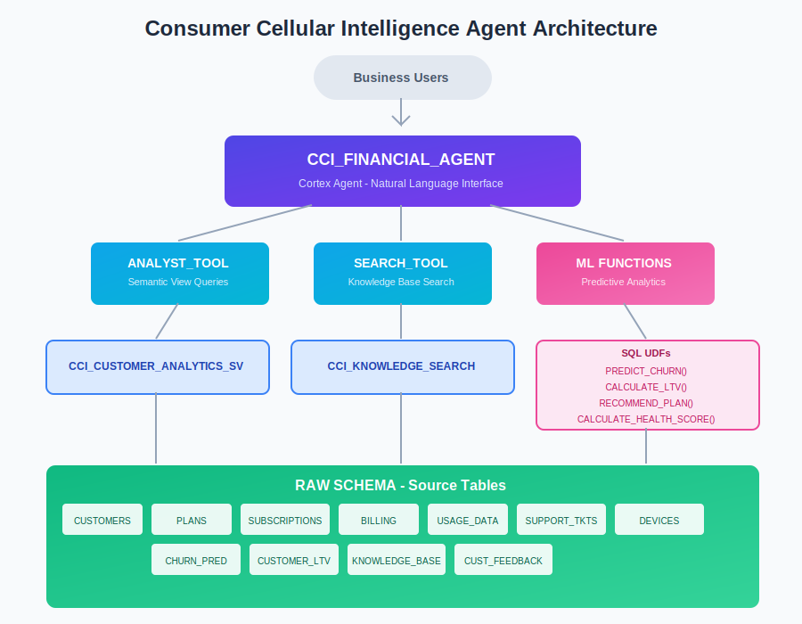
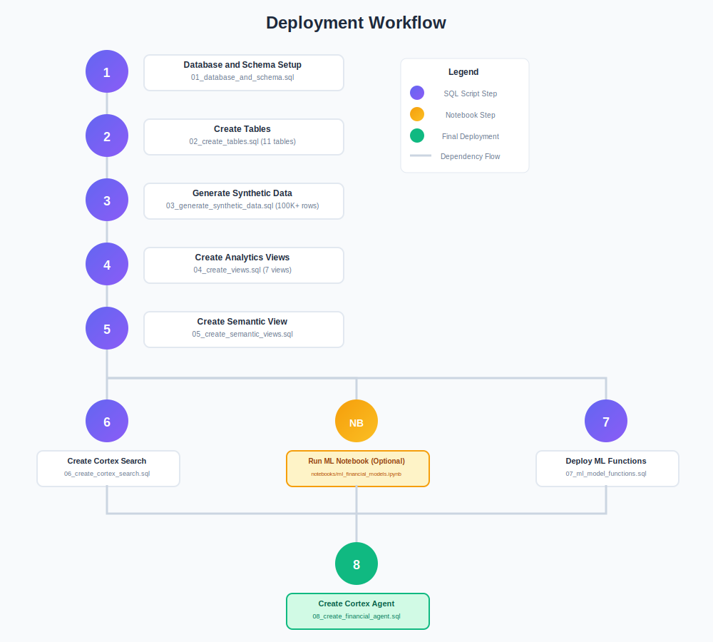
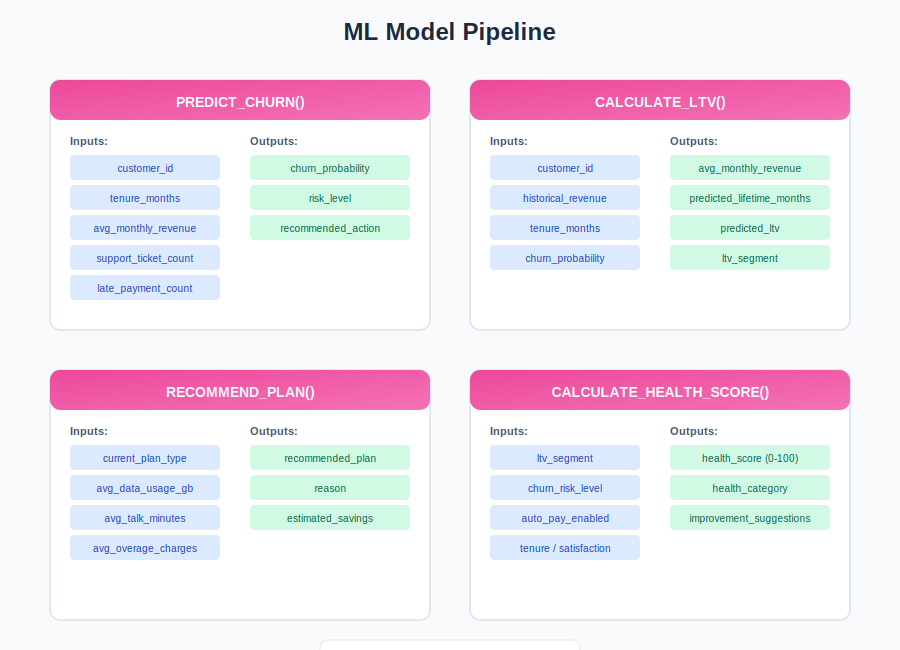

# Deployment Summary

## Project: Consumer Cellular Intelligence Agent

**Version:** 1.0.0  
**Last Updated:** 2026-02-24  
**Status:** Ready for Deployment

---

## Architecture Overview



---

## Deployment Artifacts

### SQL Scripts (Execute in Order)

| # | File | Purpose | Status |
|---|------|---------|--------|
| 1 | `sql/setup/01_database_and_schema.sql` | Database, schemas, warehouse | ⬜ Pending |
| 2 | `sql/setup/02_create_tables.sql` | 11 base tables | ⬜ Pending |
| 3 | `sql/data/03_generate_synthetic_data.sql` | 5K customers, 100K+ records | ⬜ Pending |
| 4 | `sql/views/04_create_views.sql` | 7 analytics views | ⬜ Pending |
| 5 | `sql/views/05_create_semantic_views.sql` | Semantic view for agent | ⬜ Pending |
| 6 | `sql/search/06_create_cortex_search.sql` | Knowledge base search | ⬜ Pending |
| 7 | `sql/models/07_ml_model_functions.sql` | 4 ML UDFs | ⬜ Pending |
| 8 | `sql/agent/08_create_financial_agent.sql` | Cortex Agent | ⬜ Pending |

### Notebooks

| File | Purpose | Status |
|------|---------|--------|
| `notebooks/ml_financial_models.ipynb` | ML model development | ⬜ Pending |

---

## Data Model Summary

### Tables Created

| Table | Records | Description |
|-------|---------|-------------|
| CUSTOMERS | 5,000 | Customer profiles |
| PLANS | 10 | Service plans |
| SUBSCRIPTIONS | 5,000 | Customer-plan mappings |
| DEVICES | 5,000 | Customer devices |
| USAGE_DATA | ~50,000 | Monthly usage metrics |
| BILLING | ~50,000 | Invoice records |
| SUPPORT_TICKETS | ~1,500 | Support cases |
| KNOWLEDGE_BASE | 15 | Help articles |
| CUSTOMER_FEEDBACK | ~2,000 | NPS/CSAT surveys |
| CHURN_PREDICTIONS | 5,000 | ML predictions |
| CUSTOMER_LTV | 5,000 | Lifetime value scores |

### Key Relationships

| Parent | Relationship | Child |
|--------|--------------|-------|
| CUSTOMERS | 1:N | SUBSCRIPTIONS |
| CUSTOMERS | 1:N | BILLING |
| CUSTOMERS | 1:N | DEVICES |
| CUSTOMERS | 1:N | USAGE_DATA |
| CUSTOMERS | 1:N | SUPPORT_TICKETS |
| CUSTOMERS | 1:1 | CHURN_PREDICTIONS |
| CUSTOMERS | 1:1 | CUSTOMER_LTV |
| PLANS | 1:N | SUBSCRIPTIONS |

---

## Agent Capabilities

### 1. Analyst Tool (Structured Queries)
- Customer segmentation analysis
- Revenue and billing metrics
- Churn risk assessment
- Plan performance comparisons
- Usage pattern analysis

### 2. Search Tool (Unstructured Content)
- Knowledge base article retrieval
- FAQ and troubleshooting guides
- Policy and procedure documentation

---

## Resource Requirements

| Resource | Specification |
|----------|---------------|
| Warehouse | X-Small (minimum) |
| Storage | ~50 MB (synthetic data) |
| Cortex | Claude 3.5 Sonnet access |
| Search Service | 1 hour target lag |

---

## Post-Deployment Validation

```sql
-- Verify object counts
SELECT 'Tables' as object_type, COUNT(*) as count 
FROM INFORMATION_SCHEMA.TABLES 
WHERE TABLE_SCHEMA = 'RAW'
UNION ALL
SELECT 'Views', COUNT(*) 
FROM INFORMATION_SCHEMA.VIEWS 
WHERE TABLE_SCHEMA = 'ANALYTICS';

-- Test agent
SELECT CCI_INTELLIGENCE.ANALYTICS.CCI_FINANCIAL_AGENT(
  'How many active customers do we have?'
);
```

---

## Deployment Workflow



---

## ML Model Pipeline



---

## Contact

For deployment issues, refer to `AGENT_SETUP.md` troubleshooting section.
